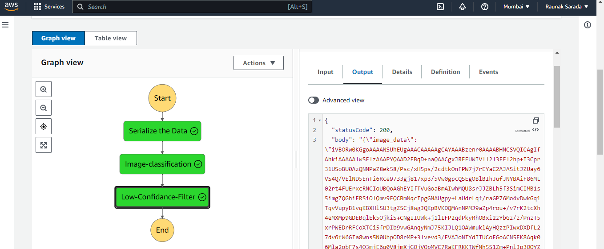

# Build-a-ML-Workflow-For-Scones-Unlimited-On-Amazon-SageMaker
### This project builds and deploys an image classification model for Scones Unlimited
### The project is divided into the following steps:

* Data staging
* Model training and deployment
* Lambdas
* Step Functions

The first step is to stage the data. This involves uploading the scone images to an Amazon S3 bucket. 

Model Training and Deployment

The next step is to train and deploy the model. This is done using AWS SageMaker. SageMaker provides a managed machine learning platform that makes it easy to build, train, and deploy machine learning models.

The model is then deployed as an Amazon SageMaker endpoint.

Lambdas

Step 1 The serializeImageData Lambda Function  takes the address of an image hosted in S3, and returns a serialized JSON object.  

Step 2 The Image-Classification Lambda Function  accepts the JSON object obtained from step 1 and sends it to an endpoint, collecting inferences as a JSON object. 

The Filter Low Confidence Inferences Lambda Function takes the inference data from step 2, and filters only the images that meet the pre-defined threshold.  

Building a State Machine via AWS Step Functions

The final step is to create a Step Functions workflow. This workflow orchestrates the entire ML workflow, from data staging to model deployment.

Running the Project

To run the project, you will need to have an AWS account. we used various AWS services like AWS lambda, step function, S3 bucket, Sagemaaker.
Conclusion

This project demonstrates how to build and deploy an image classification model using AWS SageMaker. The project also shows how to use Lambda functions and Step Functions to orchestrate an ML workflow.

Author

This project was created by Raunak Sarada.

License

This project is licensed under the MIT License.

Acknowledgments

This project was inspired by the Udacity AWS Machine Learning Engineer Nanodegree Program.

I hope this is helpful! Let me know if you have any other questions.
